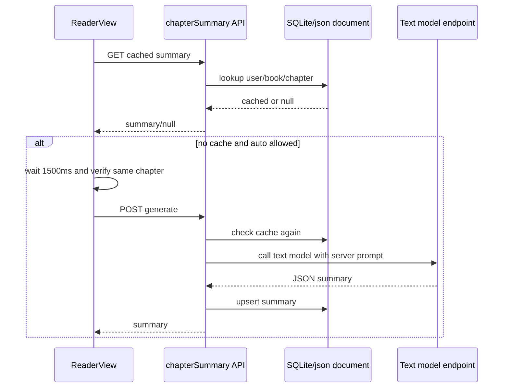

# 本章摘要设计

## 结论

做一个独立的“本章摘要”功能，不并入 AI资料生成链路。

- 阅读页在章节标题下显示一个优雅的折叠摘要卡片。
- 后端使用已配置的文本模型生成摘要。
- 后端控制 prompt、详细程度、温度、自动生成开关和缓存策略。
- 摘要按用户、书籍、章节持久化；同章再次打开直接读缓存。

这条路最短，也避免把轻量阅读辅助做成第二套 AI资料系统。

## 目标

1. 用户打开某章时，可以自动生成本章梗概。
2. 用户可以关闭自动生成，改为手动点击生成。
3. 摘要直接出现在阅读页，不离开正文上下文。
4. prompt 和模型参数由后端配置控制。
5. 摘要缓存到后端，避免重复消耗模型 token。
6. 前端视觉风格匹配现有阅读页：温和、克制、低打扰。

## 非目标

- 不做跨章节长摘要列表。
- 不做全文 RAG、向量库或图数据库。
- 不做人物关系、世界观、地图联动。
- 不自动读取未打开章节，避免剧透和额外消耗。
- 不把摘要写进现有 AI资料 memory。

这些以后需要时再加。

## 用户体验

### 阅读页位置

摘要卡片放在当前章节标题下、正文前。

默认状态：

- 没有摘要：显示一行轻量提示和“生成摘要”按钮。
- 自动生成中：显示小型加载状态，不遮挡正文。
- 已有摘要：默认折叠，显示一行预览。
- 展开后：显示完整摘要内容和操作按钮。
- 失败：显示短错误和“重试”按钮。

### 推荐视觉

卡片要像阅读页原生控件，不像后台管理面板。

- 使用当前阅读主题颜色：背景、字体、弹层色来自现有 theme/chromeTheme。
- 边框使用低对比度半透明色。
- 圆角小于弹窗，避免喧宾夺主。
- 文案简短：`AI 本章梗概`、`生成摘要`、`重新生成`、`复制`。
- 移动端保持同一折叠卡片，不另做复杂底部弹窗。

### 自动生成策略

默认自动生成，但必须满足全部条件：

1. 后端文本模型可用。
2. 用户开启自动摘要。
3. 本章没有缓存摘要。
4. 正文长度大于后端配置的 `minContentChars`，默认 300。
5. 进入章节后延迟 1500ms 仍停留在同一章。

用户快速翻章时取消旧请求结果写入当前 UI，避免错章显示和浪费视觉注意力。

## 摘要内容格式

默认输出三块：

1. `梗概`：本章发生了什么。
2. `关键人物/线索`：本章值得记住的人、物、关系或线索。
3. `伏笔疑点`：只基于当前章节，不预测未读内容。

默认长度：150-300 字。

后端配置可把详细程度调成：

- `short`：80-150 字。
- `normal`：150-300 字，默认。
- `detailed`：300-600 字。

## 后端配置

新增章节摘要配置，独立于模型 endpoint 配置，但使用现有文本模型 endpoint。

建议结构：

```ts
interface ChapterSummaryConfig {
  enabled: boolean
  autoEnabledDefault: boolean
  prompt: string
  detailLevel: 'short' | 'normal' | 'detailed'
  maxWords: number
  temperature: number
  minContentChars: number
}
```

默认值：

```json
{
  "enabled": true,
  "autoEnabledDefault": true,
  "detailLevel": "normal",
  "maxWords": 300,
  "temperature": 0.3,
  "minContentChars": 300
}
```

默认 prompt 要求：

- 使用简体中文。
- 只总结用户提供的本章正文。
- 不推测未出现内容。
- 不输出 Markdown 标题层级过深。
- 输出 JSON，字段固定，便于前端稳定渲染。

## 数据模型

后端按用户隔离保存摘要。

```ts
interface ChapterSummaryRecord {
  bookUrl: string
  chapterUrl: string
  chapterIndex?: number
  chapterTitle?: string
  summary: string
  keyPoints: string[]
  questions: string[]
  promptVersion: string
  model: string
  createdAt: number
  updatedAt: number
}
```

缓存 key：

- `user_ns`
- `md5(bookUrl + '
' + chapterUrl)`

章节标题和 index 只作为展示和排查辅助，不作为唯一身份。

## API

### 读取摘要

`GET /reader3/chapterSummary?bookUrl=...&chapterUrl=...`

返回：

```ts
{
  "summary": ChapterSummaryRecord | null
}
```

### 生成摘要

`POST /reader3/chapterSummary/generate`

请求：

```ts
{
  "bookUrl": string,
  "chapterUrl": string,
  "chapterIndex": number,
  "chapterTitle": string,
  "content": string,
  "force": boolean
}
```

行为：

- `force=false` 且已有缓存时直接返回缓存。
- `force=true` 时重新调用模型并覆盖缓存。
- 后端校验 content 非空，且长度达到 `minContentChars`。
- 后端使用现有 `AiModelService` 的文本模型配置。
- 模型不可用时返回明确错误，不让前端猜。

### 读取配置

`GET /reader3/chapterSummary/config`

非管理员可读取安全字段；管理员可读取完整配置。

### 保存配置

`POST /reader3/chapterSummary/config`

需要管理员权限，沿用现有 AI 模型配置的 admin 判断。

## 生成流程



## 前端状态

ReaderView 增加本章摘要状态，不新增全局 store，先保持局部最小化。

```ts
type ChapterSummaryStatus = 'idle' | 'loading' | 'ready' | 'error'
```

需要维护：

- 当前章节 summary。
- 当前请求 token / chapter identity，防止错章写入。
- 用户本地设置：是否自动生成摘要。

用户自动开关放在阅读设置里，保存到现有 `readConfig`，字段建议：

```ts
enableChapterSummaryAuto: boolean
```

## 错误处理

- 模型未配置：卡片显示“文本模型未启用”，提供手动重试但不自动循环。
- 正文太短：不自动生成，显示“本章内容较短，可手动生成”。
- 生成失败：保留旧摘要；没有旧摘要时显示错误。
- 返回 JSON 不完整：后端尝试轻量修复；失败则返回明确错误。
- 用户切换章节：旧请求结果丢弃，不更新当前 UI。

## 测试

最小检查：

### 后端

- config 默认值和保存读取。
- 非管理员不能保存配置。
- 同用户同章生成后可读取缓存。
- `force=false` 命中缓存不调用模型。
- content 为空或太短返回错误。

### 前端

- 无缓存时显示生成按钮。
- 已缓存时显示折叠摘要。
- 自动开关关闭时不触发生成。
- 快速切章时旧请求不污染新章节。
- 生成失败时显示错误和重试。

### 手动验收

1. 配好后端文本模型。
2. 打开一本书某章，等待 1.5s，摘要卡片生成。
3. 刷新同章，摘要直接从缓存显示。
4. 关闭自动摘要，切到新章，只显示“生成摘要”。
5. 点击“重新生成”，摘要更新。
6. 移动端宽度下卡片不遮挡正文。

## 实施顺序

1. 后端模型和服务：配置、缓存、生成接口。
2. 前端 API 封装。
3. ReaderView 摘要卡片和状态控制。
4. ReadSettings 增加自动摘要开关。
5. 测试和本地 smoke。

## 风险

- 长章节 token 成本高。先限制输入长度，必要时截取前后文或提示用户手动生成。
- 模型输出非 JSON。后端做一次修复，失败就明确报错。
- 阅读页文件较大。先做局部最小改动，后续真的变重再抽组件。
- 自动生成可能打扰阅读。默认折叠、延迟触发、只无缓存生成。
